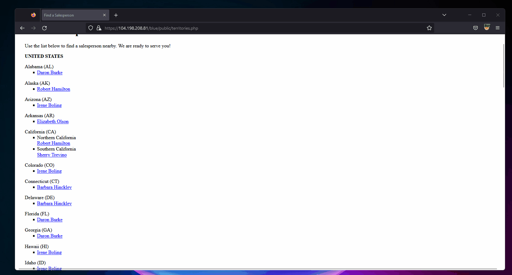
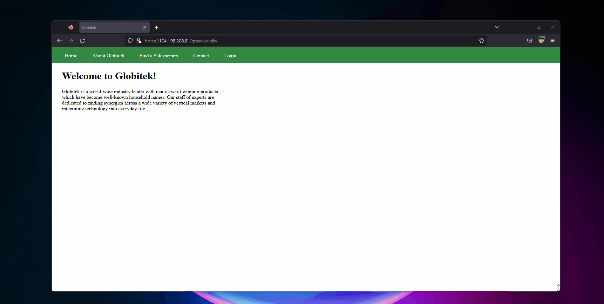
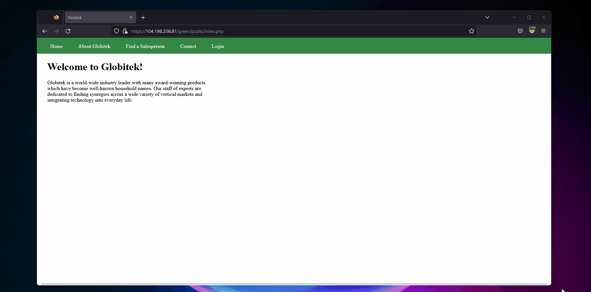
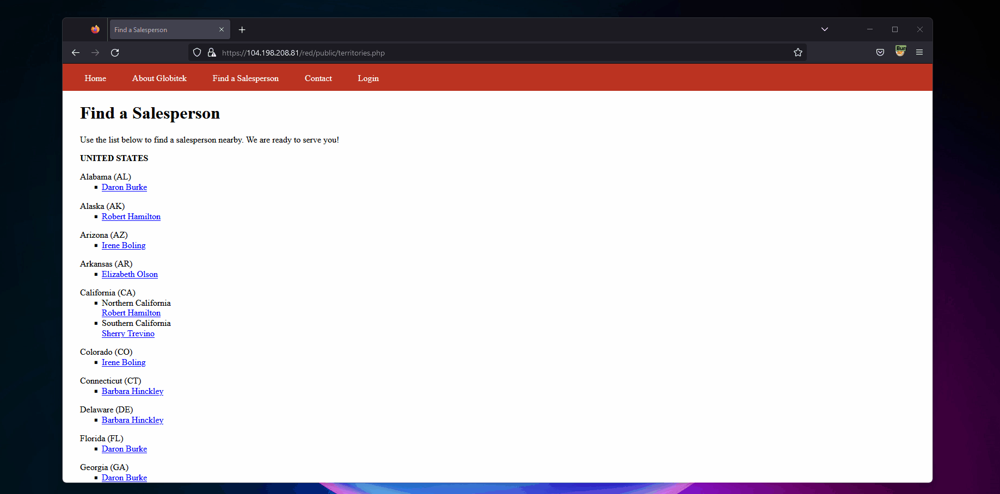
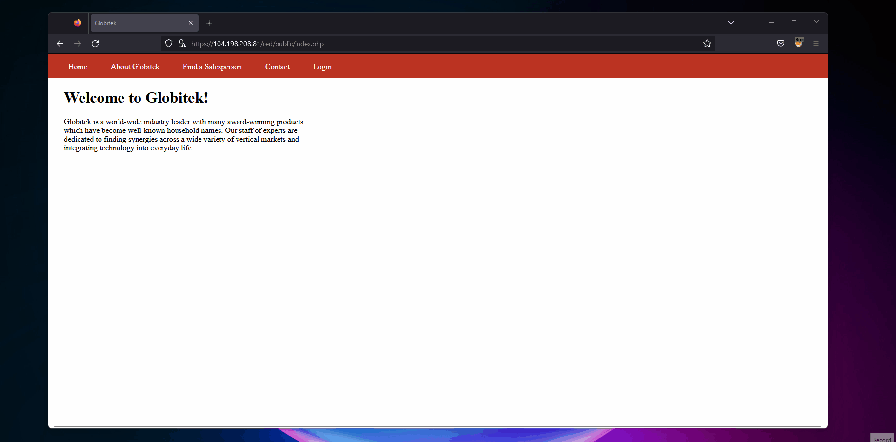

# Pen Testing Live Targets

Time spent: **12** hours spent in total

> Objective: Identify vulnerabilities in three different versions of the Globitek website: blue, green, and red.

The six possible exploits are:

* Username Enumeration
* Insecure Direct Object Reference (IDOR)
* SQL Injection (SQLi)
* Cross-Site Scripting (XSS)
* Cross-Site Request Forgery (CSRF)
* Session Hijacking/Fixation

Each color is vulnerable to only 2 of the 6 possible exploits. First discover which color has the specific vulnerability, then write a short description of how to exploit it, and finally demonstrate it using screenshots compiled into a GIF.

## Blue

Vulnerability #1: SQL Injection

Description:
In ` 104.198.208.81 ` has a tab called ` Find a Salesperson `. Once thing I noticed was the id numbers with each salesperson, so this tells me that there is an account that is considered admin. Putting the basic SQL injection for admin ( ` 'OR 1=1' `) in the URL with a random Salesperson it redirected me saying ` Database query failed. `. This tells me that the ` Find a Salesperson ` page is not properly sanitizing queries. So adding the double hyphen ` -- ` into the attack turns it to a comment which takes me to the admin account; or in this case `id=1`. 

Vulnerability #2: Session Hijacking

Description:
Looking into users via ` pperson ` credentials I notice that the PHP sessions were vulnerable thorugh burp. Using the  `change PHP session` tool I was able to change the ` index.php ` PHPSESSID from ` ocppafsrts0fdj5mq7d50uloi3 ` to ` Hellothere `. This can be a problem because if a threatactor see's that the session is susceptible for a hijacking attack then the user is vulnerable. 

## Green

Vulnerability #1: Cross-Site Scripting (XSS)

Description:
Looking at the tabs in this site one particular one stood out which is ` Contact `. When you click on it there is forms to put in information. This can be considered an expoit because it is susceptible to XSS. I decided to use an alert xxs script because it is easier to make and would let me know whether or not the attack is successful. After putting `  `, I was prompted ` Tanya found the XSS `, but when I looked into the feedbackl it showed that my XSS attacks went through successful.

Vulnerability #2: Username Enumeration

Description:
In this test it goes to show how the threatactor can tell if he/she is sucessful into finding the credentials for an account. I used the pperson credentials as an example. When I type in `pperson9999` with a random password I was alerted with `Log in was unsuccessfull`; however, when I do the same thing thing but with a correct user `pperson` with a random password that same alert went bold. Which tells me that if this attack was brute forced and was made to look for changes within the login attempts, then the threatactor would be able to tell what the correct username is. 

## Red

Vulnerability #1: IDOR

Description:
Here shows guest having roles that they shouldn't even have. The max number of users I saw were 9 or `id=9`. When I go over like `id=10` or `id=11`, then it shows users that are not even sales persons. This can mean either the threatactor made a user for themself or a guest user was misplaced which can lead to many exposed exploits. 

Vulnerability #2: Cross-Site Request Forgery

Description:
In this one I looked at the inspection element and decided to see if I could edit the user information. The first place I looked into was the csrf token, and to see if I am able to change it. Well I was able to which is bad because I should not be able to, and because of that I was able to change the user info. 

## Notes

I did not really face much challenges, it was just a lot of re-reading materials to find something that works. Out of all of them the CSRF task was very long and I dont like working on that type of work. 
